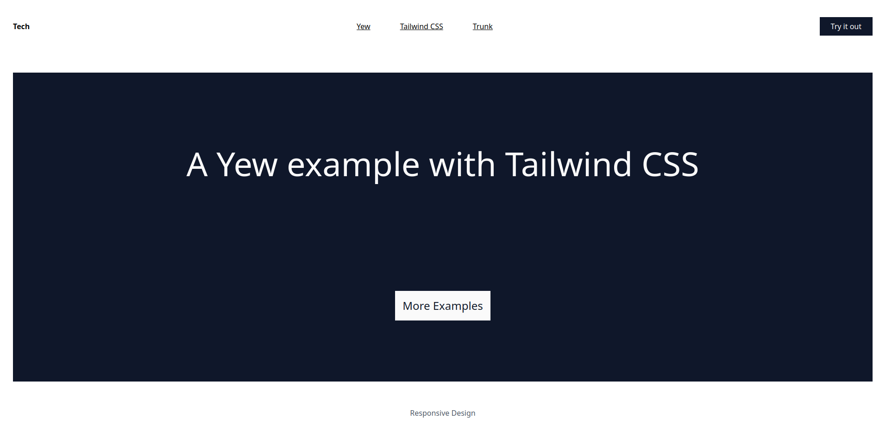

# An example using Yew and Tailwindcss

## About this example



### Tailwind CSS Configuration

To configure Tailwind CSS, changes are introduced in ```tailwind.config.js```, ```index.html```, ```src/input.css```, ```Trunk.toml```

### Serve with Trunk

```trunk serve --open```

## Credit
Page design modfied from a free [webflow](https://webflow.com/) template.